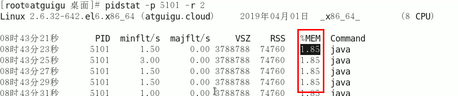

# 生产环境服务器变慢，诊断思路和性能评估？

从如下角度出发进行分析

- 整机
  - top
- cpu
  - vmstate
- 内存
  - free
- 硬盘
  - df
- 磁盘IO
  - iostat
- 网络IO
  - ifstat


## top

- load average代表系统1分钟，5分钟，15分钟的平均负载值
  - 3个值相加/3 * 100 高于 60 ，说明负载重
- 按键盘的1，可以显示出所有cpu核的参数的详细情况


- uptime是top的简化版本

 


## vmstat

- 示例：每2s采样一次，共采样3次

 

 


## mpstat

- 查看所有cpu信息
  - 主要查看idle，越高越好，低于60%说明系统有压力了

```bash
mpstat -P ALL 2 # 每2s打印一次
```

 


## pidstat

- 每个进程使用cpu的用量分解信息
  - pidstat -u 1 -p {pid}
    - 每隔1s查询一次


## free

- 查看内存

- 查看应用程序可用内存
- -g表示GB，-m表示MB显示

 

- 查看额外
  - pidstat -p {pid} -r 采样间隔秒数

 


## df

- 查看磁盘
- df -h


## iostat

- 磁盘IO
  - 2 表示取样间隔2s
  - 3 表示取样3次


 

- 使用pidstat查看

 


## ifstat

- 网络io
- 默认本地没有，下载


- 使用

 


# CPU占用过高定位分析

使用jstack定位出错线程

- 使用top命令找到cpu占比最高的pid

- 使用ps -ef 或者 jps进一步定位
- 找到java进程编号

```bash
jps -l
```

- 获取tid
- 方式1：对该进程编号的所有线程查看cpu的使用情况，找到线程使用cpu资源最多的pid

```bash
top -Hp {pid1}
```

- 方式2：使用ps -mp {pid} -o THREAD,tid,time，获取tid信息
  - -m 表示所有线程
  - -p pid进程使用cpu的时间
  - -o 该参数后是用户自定义格式

 

- 将该tid转换为16进制

```bash
printf '%x\n' {tid}
```

-  利用 jstack 打印出 java 线程调用栈信息
  - 因为 java native 线程以 16 进制形式输出
  - 注意tid的==十六进制小写==

```bash
jstack {pid1} | grep '{0Xtid}' -A 50 --color
```


