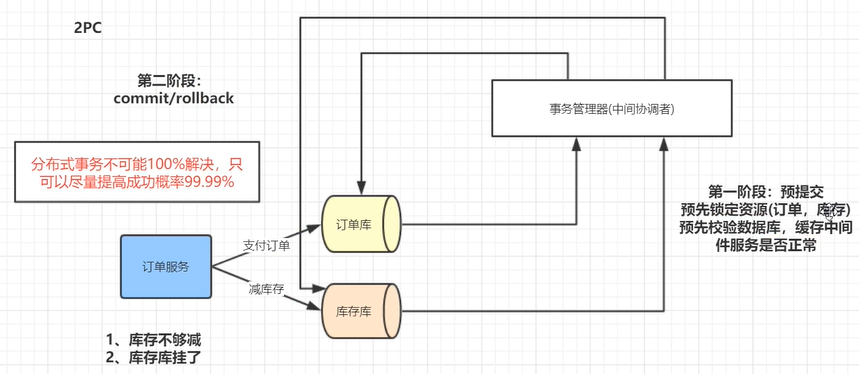

# 2阶段提交

## 分布式事务

 

  

## XA/JTA 规范（一个服务操作2个库的分布式事务）

 

- 事务管理器收到所有库的预提交信息（将sql写入到数据库操作日志中，但是没有提交）后，给所有库发送提交可以提交信息（如果有一个库预提交失败，那么事务管理器会给所有库回滚操作）
- 由于不能100%的保证，在第二阶段提交时，如果有一个库失败，那么需要有重试机制，补偿机制，或者记录日志，人工干预

### atomikos

 

- 示例

 

 

 

### 模拟2PC

- 使用javax接口模拟

 

- 示例

## 柔性事务 TCC

-  添加中间状态表
  - 如：库存服务添加冻结字段，用于冻结库存数目
- 系统需要开发3套API
  - 预留资源API
    - 将库存冻结字段进行修改为1
  - 提交API
    - 将冻结字段修改为0，将库存字段-1
    - 如果因为网络问题出错，则重试，打日志log，后期定时补偿，人工维护
    - 重试需要有接口的幂等 性
  - 回滚API
    - 将冻结字段修改为0

 

- 对比
  - 重点关注数据库的锁的持有时间

 

