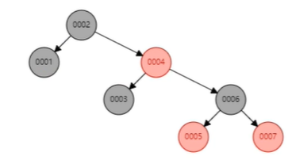

# 索引结构，为什么使用B+树

- 建表之后，会在data文件夹下有对应的数据库的文件夹

  - 在该文件夹下有frm文件和ibd文件
    - 如employees.frm
      - frm：表存储结构，frame
    - 如employees.ibd

- 索引
  - 二叉树 Binary Search Tree

    - 左小右大，存储在数组中，mysql使用二叉树可以提升一倍的查询速度

    

    - 为什么不用二叉树，如果col是按顺序出插入的，那么右边都是大的
      - 会退化成链表，那么查询效率和没有索引是一样的

    

  - 红黑树 Red Black Tree

    - 5个约束

      - 根节点必须是黑色

      - 插入的叶子节点是红色的

      - 红色节点不能相邻，黑色节点可以相邻

        -  如果一样则需要旋转变色

         

      - 左小右大

    - 复杂度O(logn)

    - 缺点：向右倾斜，没有二叉树效果效率高，树的高度越高，查询效率越低 

  - BTree

    - 缺点：一块单位磁盘空间有限16k，存储了节点的索引的同时又要存储data，可以存储的节点不多，那么度就比较小，深度比较小

  
  
  
  
  - B+Tree
    - 叶子节点有顺序访问指针，支持范围查询
  
  
  
  
  
  - Hash
    - 在Mysql中支持创建hash索引

- 既然Hash可以成为索引的格式，为什么不使用hash创建索引的结构

   
  - 首先在没有hash碰撞的情况下，查询效率比B+Tree效率要高
  - 在有hash碰撞的情况下，会存储在链表中，那么会增加链表的长度，在查询时，会遍历链表
  - 同时不支持范围查询，不像B+树
  - 适用场景
    - 如果是范围查询，或者模糊查询则不适合
    - 如果是精确查询，可以考虑使用hash

 

# InnoDB与MyISAM的区别

- 基于表设置的
- InnoDB支持事务
  - ibd结尾的文件存储了数据和索引
- MyISAM不支持事务
  - MYD，存储数据
  - MYI，存储索引
- frm 存储表结构 frame

 

## InnoDB索引（聚集索引）

- 为什么叫聚集索引：数据和索引是存储在一起的
- 使用B+树

 

- 注意，非主键索引存储的是主键索引的ID
  - 如果通过Alice查询，三次查询到主键ID，然后在主键索引中查询18，又要经历3次，为什么这么设计
    - 使用时间换空间，如果非主键索引存储了数据而非主键索引，那么如果有大量数据，空间会占用很多
    - 同时，InnoDB是事务性存储，行的数据会时刻修改变动，如果存储了2份，在主键索引中存储，在非主键索引中存储，那么会导致事务实现的复杂，也会影响事务的稳定性

## MyISAM

- 也是使用B+树，但是叶子节点存储的是数据的磁盘地址，通过地址找到数据

# 联合索引

 

- 使用到了索引

 

- 没有用到索引

 

- 没有匹配上的原因（type=ALL 全表扫描）

### 最左原则

- 第一个匹配后才会进行第二个匹配，否则全表

### 查询优化

- 查询顺序不同，但是会进行优化查询处理

 

### 范围查询

 

- 有范围的查询，是用到了部分索引的

# InnoDB怎么保证必有主键？为什么推荐使用整型的自增主键？

- 1.如果没定义主键，则找第一个unique字段索引，not null并作为聚集索引
- 2.如果没有则InnoDB会在内部生成一个隐藏的聚集索引GEN_CLUST_INDEX
  - 使用默认的性能会有所下降

- 为什么推荐整型自增主键？
  - 由于B+树中叶子节点==有序==存储了索引与数据，如果使用字符串，或者非自增字段，每次新增数据时，会有插入叶子节点的操作，那么会导致整个B+树索引频繁重建
  - 尽量使用自增主键

# 为什么非主键索引结构叶子节点存储的是主键值而不是数据？

- 时间换空间
- InnoDB的数据一致性

