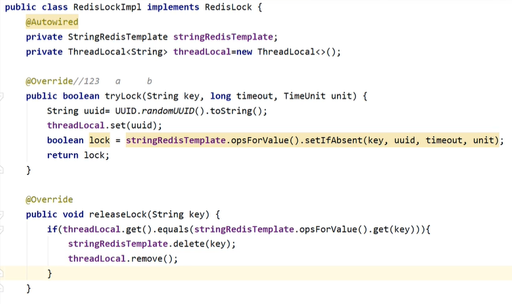
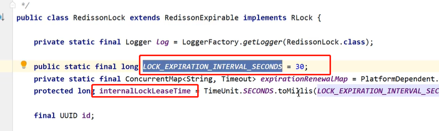

# 分布式锁

## 设计目标

 

## 无锁分析

- demo：下单场景，没有添加分布式锁
  - 问题：数据不一致性，有脏数据产生

## 简单加锁

- 命令

 

- 分布式锁简单实现

 

## 添加锁超时

- 考虑到宕机的情况，还有kill-9的情况，增加超时时间

 

- 注意：超时时间和key的设置要是原子操作，否则依然会有死锁的情况产生

 

## 封装

- 解决锁可以被其他线程释放的问题

## 支持阻塞

## 支持可重入

- 对于可重入的设计，在ThreadLocal中判断UUID是否存在，存在则说明已经加了锁，直接返回true
  - 问题：当递归调用，或者其他方法包含加解锁的操作时，会导致提前解锁，那么数据一致性会有问题
- 解决：添加计数器，当有加锁操作时，计数器+1，解锁操作时，计数器-1，计数器为0则真正释放
  - 定义一个ThreadLocal<Integer>

## 异步续命

- 当锁中的业务执行时间过长，超过了锁的等待时间，提前释放了锁，会造成数据的不一致性
- 此时需要重新设置key的过期时间，开启一个新的线程，并记录线程的id，在key的release的时候进行释放线程
  - 线程的创建最好在获取锁之后进行

# Redisson的使用

- 使用Redisson实现的分布式锁
- lock是阻塞的锁，trylock是非阻塞的

## 阻塞的实现

 

## 锁超时实现

- 增加锁的超时时间，默认是30s

- 使用lua脚本设置过期时间，并开启一个线程进行异步续命

# CAP

 

AP：数据写入后，node1会立刻返回结果

CP：数据写入后，node1节点会和其他节点进行数据同步，同步完成后再返回结果（注意ZK是过半数据同步后就返回数据）

## redis分布式锁失效情况

- 使用redis时，会有从节点没有更新的情况导致锁失效

 

## ZK分布式锁的失效情况

- 只同步一半，那么从未同步的节点获取数据，也有数据一致性的问题

## RedissonRedLock

- 一般不使用
- 解决Redis分布式锁失效的情况
- 同时创建多个锁，多个锁过半获取，说明获取到了分布式锁，用于避免redis分布式锁因为主从数据同步的问题
  - 注意多个锁必须存储在redis集群的不同主节点上

# Redis分布式锁的性能提高

- 多台redis多节点，当redis并发量太大的时候，如何保证锁的性能
  - 如库存10000，如何在高并发的情况下将库存消耗掉
    - 使用分而治之的思想，设置多个key，每个key含有库存200，进行划分

