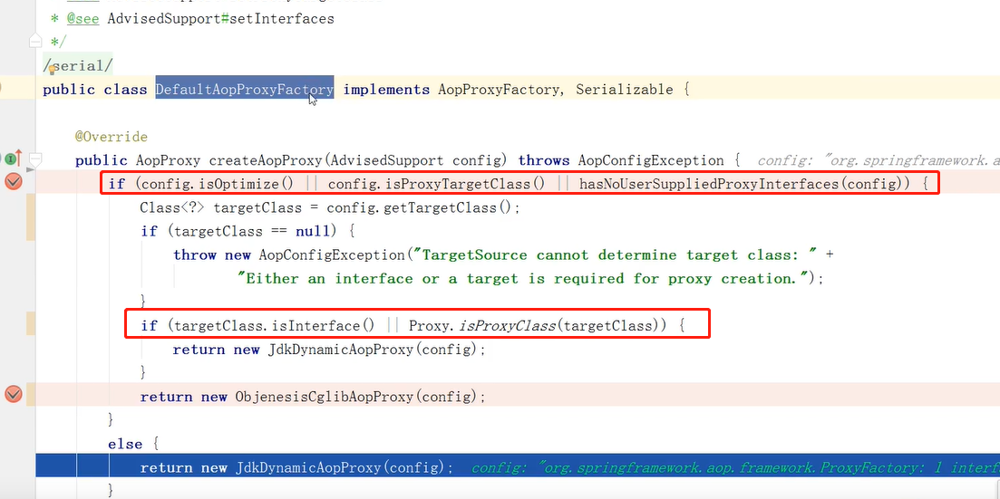
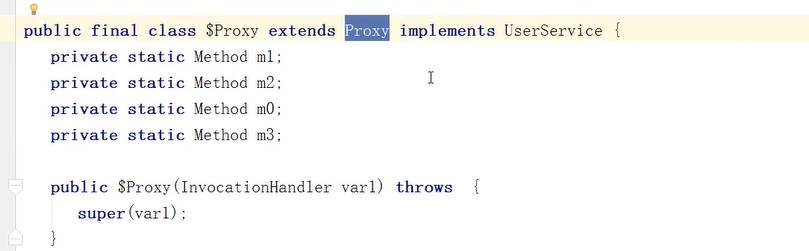

# AOP

 

 

- 事务也是通过aop实现的

 

- 简单使用

 

- 执行代码

- 底层是jdk动态代理

- 底层是cglib动态代理

 

## 动态代理

- java动态代理
  - 使用前提：被代理的类必须是接口
- cglib动态代理
  - 被代理的类可以不是接口

spring的AOP使用的是2者的结合

- 问题，调用的时候，什么时候成为代理对象的，是在ioc容器创建完成后，还是从ioc容器获取的时候？
  - ioc容器是一个concurrentHashMap
  - 使用条件断点进行调试

- 查看断点结果，在向IOC容器中PUT的时候就不是原始对象，而是代理对象了，==说明在IOC初始化对象时，就将原先的对象生成代理对象==
  - 好处是提高bean的使用效率

- 判断父类是否是接口，不是接口切换代理的实现

 

## jdk动态代理与cglib动态代理的区别

- java动态代理是==利用反射机制生成一个实现代理接口的匿名类==，在调用具体方法前调用InvokeHandler来处，而cglib动态代理是利用asm开源包，对代理对象类的class文件加载进来，==通过修改其字节码生成子类来处理==
  - 如果目标对象实现了接口，默认情况下会采用JDK的动态代理实现AOP
  - 如果目标对象实现了接口，可以强制使用CGLIB实现AOP 
  - 如果目标对象没有实现了接口，必须采用CGLIB库，spring会自动在JDK动态代理和CGLIB之间转换
- 如何强制使用CGLIB实现AOP？
  - 添加CGLIB库，SPRING_HOME/cglib/*.jar
  - 在spring配置文件中加入<aop:aspectj-autoproxy proxy-target-class="true"/>
- JDK动态代理和CGLIB字节码生成的区别？
  - JDK动态代理只能对实现了接口的类生成代理，而不能针对类
  - CGLIB是针对类实现代理，主要是对指定的类生成一个子类，覆盖其中的方法因为是继承，所以该类或方法最好不要==声明成final==

- cglib生成字节码文件

- 自己生成字节码文件

## 为什么java动态代理必须是接口？

原因是代理对象已经继承了一个Proxy对象

而java是单继承，多实现的，必须实现接口的方式完成对象的功能

 

