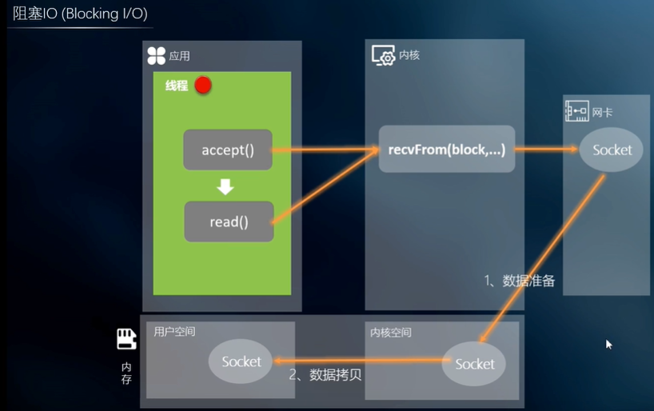

# 网络协议

# 网络IO流程

- 注意内核空间的data和用户空间data的区别

# Linux IO模型

 

# 阻塞IO

# 非阻塞IO

- 不是NIO，NIO是指new IO，新的IO解决方案
- 非阻塞IO占用CPU高

# NIO（IO多路复用）

- 基于事件驱动的
- 使用底层Epoll实现
  - Epoll维护一个Socket链表，并且循环遍历该链表中的各个Socket，判断该socket是否有数据读写
  - 当有一读写事件产生，会通知应用层线程的多路复用器，进行处理，没有事件时是进行阻塞的

## 关于零拷贝

- 将数据保存在直接内存中进行处理，用户空间和内核空间存储的是直接内存的地址进行使用
- 用户空间不直接使用该数据，而是在直接内存中使用，减少了从系统内存拷贝到用户空间的资源消耗

# BIO、NIO、AIO的区别

# 基于事件驱动&基于线程驱动

- 基于线程驱动：
  - 一个线程对应一个客户端，对应一个socket连接
- 基于事件驱动
  - 一个线程对应多个事件，或者一个线程对应一个事件（事件由多个客户端触发）
  - 注意：线程在操作读和写事件时，会将事件的处理放在线程池中进行，提高线程处理效率

# NIO的3中Reactor模型

## Reactor单线程

## Reactor多线程

## Reactor主从模型

- 

# BIO、AIO、NIO的使用场景

 

- BIO还可以用于实现桌面软件，使用NIO也可以实现，但是NIO实现复杂