# ORM

- 实现面向对象中，不同类型系统之间的转换（服务端和数据库端2个系统内部数据的转换）

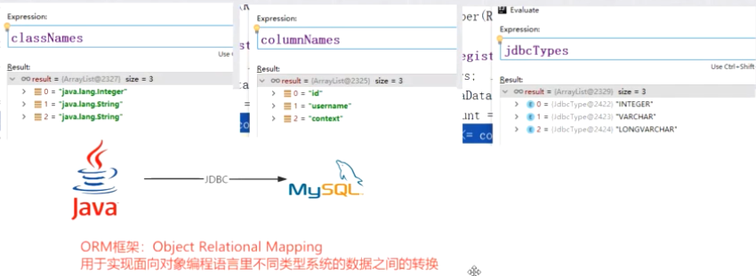 

# 关于Mybatis

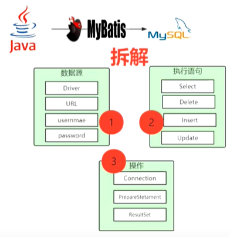 

# 核心流程与源码分析

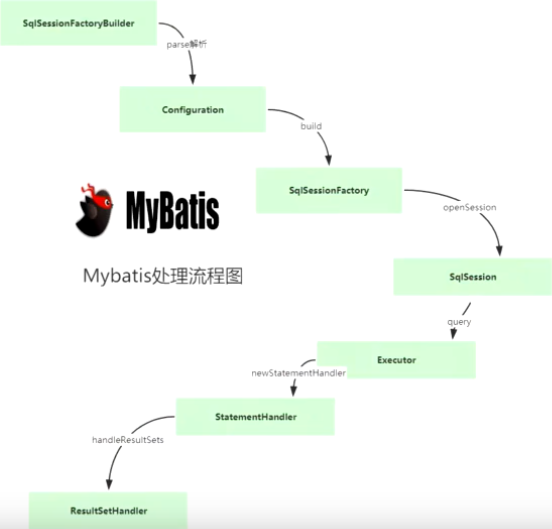 

SqlSession 不是线程安全的，每个线程一个，每次请求通过openSession会创建一个新的

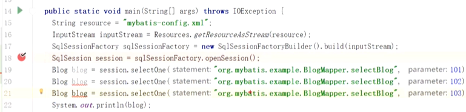

Spring和SqlSession整合之后是线程安全的，注入SqlSession，全局就一个

## 读取数据源

- 通过mybatis-config.xml配置，读取数据库数据源

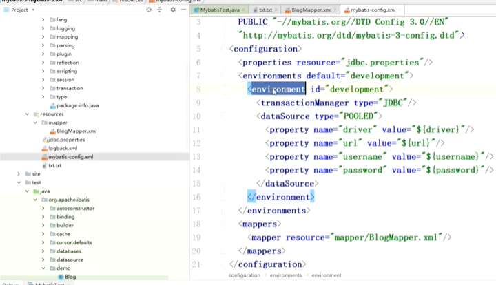

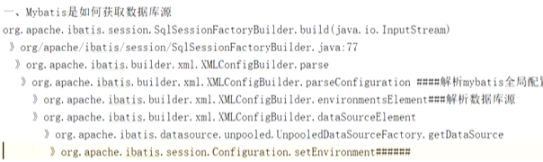

- 读取mybatis-config.xml配置文件，生成dataSource

## 如何获取SQL

- sql的mapper路径配置于mybatis-config.xml中
- 问题：mapper配置有几种方式？优先级如何
  - 有`<package> <mapper resource=> <mapper url> <mapper class>`
  - 通过源码分析package 优先级最高，resource>url>class
  - 如果resource和url 或class同时存在则会有异常

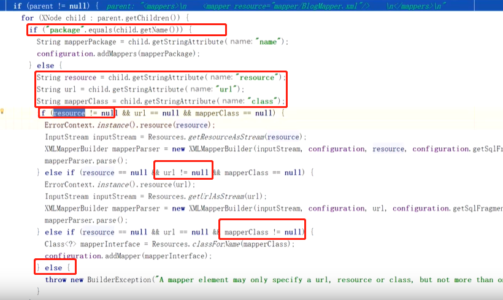

- 源码流程

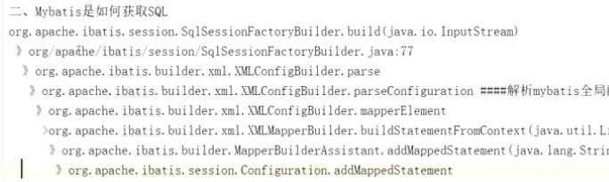 

## 如何操作数据库

- 调用jdbc

# mybatis有多少种执行器，默认哪种执行器？

- 3种：Batch，Reuse，Simple

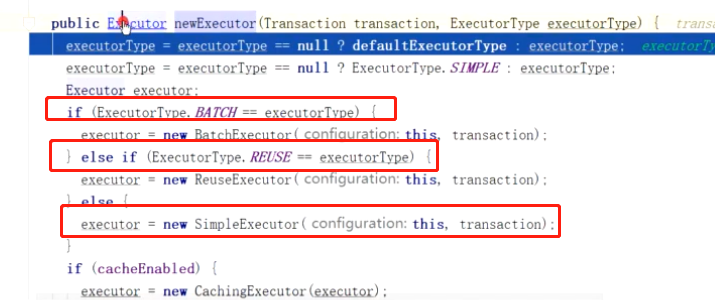 

- 默认是SIMPLE执行器

  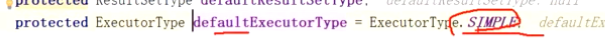 

SimpleExecutor是最简单的执行器，根据对应的sql直接执行即可，不会做一些额外的操作；

BatchExecutor执行器，顾名思义，通过批量操作来优化性能。通常需要注意的是批量更新操作，由于内部有缓存的实现，使用完成后记得调用`flushStatements`来清除缓存。

ReuseExecutor 可重用的执行器，重用的对象是Statement，也就是说该执行器会缓存同一个sql的Statement，省去Statement的重新创建，优化性能。内部的实现是通过一个HashMap来维护Statement对象的。由于当前Map只在该session中有效，所以使用完成后记得调用`flushStatements`来清除Map

# mybatis 一级缓存默认开启

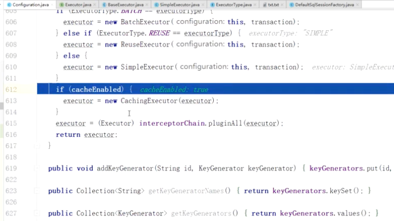 